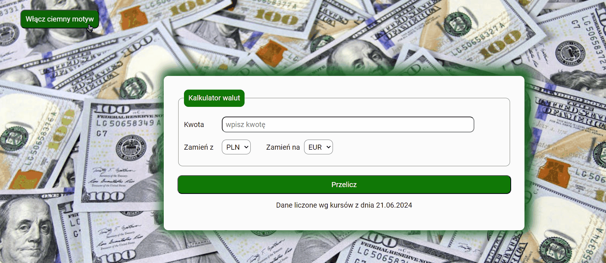
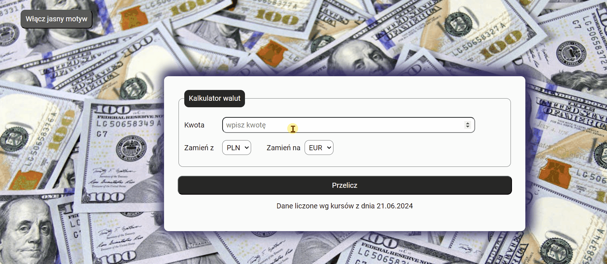

# CURRENCY CONVERTER

## Demo
https://patryk-majchrzak.github.io/currency-converter/

## Description

Hi! Welcome to my currency converter, where you can convert pick currency you want to exchange from and currency you need to change for and calculate the result. Hope you enjoy it. Hope you'll enjoy it 😊 Below som information for users how to navigate through the website and information for developers about code itself. So, what are you waiting for? Click th link in the demo and try it out 😉

## Details for users

1. Website is available only in polish (I am about to add language selection in thee future, so it will be available in english as well)
2. You can change graphics by clicking "włącz ciemny  motyw" (enable dark motive) button. Button will now say "Włącz jasny motyw" (enable bright motive). If you click once again graphics will go back to default and button label will change once again to "włącz ciemny  motyw" (enable dark motive)

3. Currently there are four available currencies to chose from: PLN, WUR, USD and GBP
4. Input "kwota" (amount) has basic validation, it has to be fulfilled, amount has to be higher than 0.00, and it has to be round to 0.01
5. To use the currency converter just put the amount in "kwota" (amount) input, select currency you want to trade from "zamień z" (exchange from) select and currency you want to receive from "zamień na" (exchange to) select. Then click "przelicz" (calculate) button and message with the result will appear at the bottom.

## Details for developers

1. JavaScript code has been closed in a block to avoid setting global functions or variables
2. All JS interactions are closed in separated functions with function init called as a first one and then calling one further interactions
3. For naming classes for HTML mark-ups I've used BEM convention for any class I was using in CSS. For classes used in JS I used prefixes "js-". All of them are written in camelCase.
4. For paragraph with "zamień z" and "zamień na" selects I used flex layout creation module